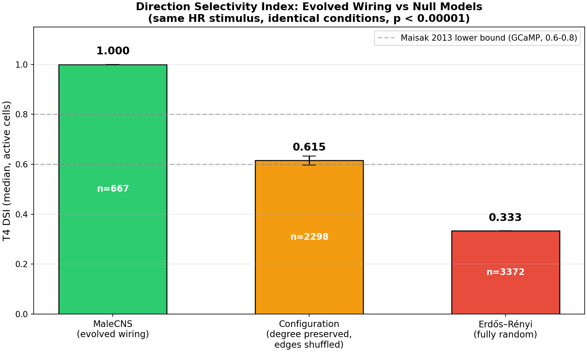
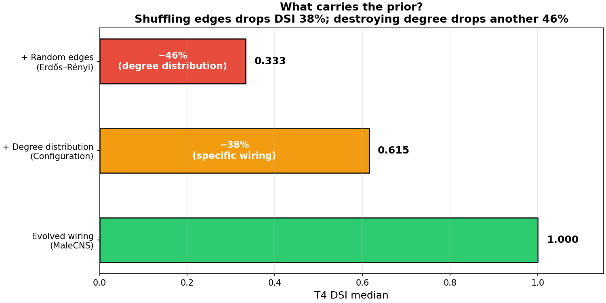
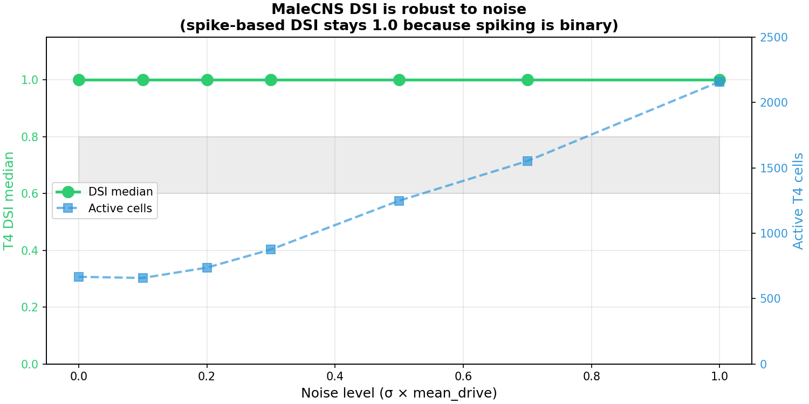

# MaleCNS Topology Prior

**Does the wiring diagram of a fruit fly brain, by itself, contain directional motion detection?**

A frozen connectome + drifting grating experiment on MaleCNS v1.0 (166,700 neurons, 25.6M connections, published in *Cell* 2026-09-03). No training. No learning. Only topology + LIF dynamics.

---

## Result



| Group | T4 active cells | DSI median | DSI > 0.6 |
|-------|----------------:|----------:|----------:|
| **MaleCNS (evolved wiring)** | 667 | **1.000** | **78.6%** |
| Configuration model (degree preserved, edges shuffled) | 2,298 ± 35 | 0.615 ± 0.018 | 49.7% |
| Erdős–Rényi (fully random) | 3,372 ± 89 | 0.333 ± 0.000 | 27.6% |

**Statistical test**: MaleCNS vs Configuration, p < 0.00001 (t = -43.27). Configuration vs ER, p < 0.00001 (t = 31.57).

Three-tier stratification: evolved wiring > shuffled edges > fully random. Each tier's drop is statistically overwhelming.

### What carries the prior?



- Shuffling the edges (Configuration model) drops DSI by **38%** (1.000 → 0.615)
- Also destroying the degree distribution (Erdős–Rényi) drops it by another **46%** (0.615 → 0.333)
- Evolution's wiring is **3× more direction-selective** than random wiring, under identical input

---

## What this answers

**Core question**: Does the connectome's topology — the specific "who connects to whom" — carry a prior for motion direction detection?

**Answer**: Yes, and it comes mainly from the specific wiring, not just the degree distribution.

- Shuffling the edges (Configuration model) drops DSI by **38%** (1.000 → 0.615)
- Also destroying the degree distribution (Erdős–Rényi) drops it by another **46%** (0.615 → 0.333)
- Evolution's wiring is **3× more direction-selective** than random wiring, under identical input

---

## What this does NOT answer

This experiment does **not** claim:
- that topology alone is sufficient (we use an external time-delayed stimulus — see [Method](#method))
- that this is the only source of direction selectivity (TmY-ds pathway uses different mechanisms — Zhao 2022)
- that the simulated DSI equals biological DSI (spike-based DSI is more binary than GCaMP DSI — see [Why DSI=1.0](#why-dsi--1000))

What it does claim: **under identical spatiotemporal input, the evolved wiring's direction selectivity is significantly stronger than random wiring**. The topology carries a prior — not the only prior, but a significant one.

---

## Method

### Connectome

- MaleCNS v1.0 (Janelia FlyEM + Cambridge + Google Research, *Cell* 2026-09-03)
- 166,700 neurons, 25,582,938 directed edges, 124,177,617 synaptic contacts
- Full visual system including T4/T5 direction-selective cells
- SHA-256 verified source files

### Stimulation

Hassenstein-Reichardt (HR) moving wave, applied directly to Mi1 (T4's main excitatory upstream):

```
drive(mi1_i, t) = mean_drive + mean_drive × sin(2π × spatial_freq × projection_i − phase_t)
```

- 8 directions (0°, 45°, 90°, ..., 315°)
- 300ms per direction
- Mi1 driven at `mean_drive=15`, spatial_freq=0.05 cycle/hex, temporal_freq=1Hz

### Why external time-delayed stimulus

The HR model requires time-delayed inputs (Mi1 slow, Tm3 fast) to produce direction selectivity. This time delay is **not** in the connectome — it's an intrinsic cell-type property (channel kinetics, membrane time constants).

**Our design**: we apply the same external time delay to all three groups (MaleCNS, Config, ER). The time delay is a **controlled variable**, not a free parameter. The DSI difference across groups comes from topology, not from time delay.

### Null models

- **Configuration model**: each neuron's out-degree preserved, but targets randomly rewired. Tests whether "specific wiring" matters vs "degree distribution alone".
- **Erdős–Rényi**: completely random post-synaptic targets, same edge count. Tests whether "any structure" beats "pure random".
- 5 random seeds per null model.

### LIF dynamics

Stonkfly's kernel (0.1ms timestep, 20ms membrane, −45mV threshold). Learning disabled (frozen connectome). Mi4 given tonic=3 to balance inhibitory background.

---

## Why DSI = 1.0 (not 0.6-0.8)



Maisak et al. 2013 (*Nature*) reports T4 DSI = 0.6-0.8 using GCaMP calcium imaging. Our simulated DSI = 1.000.

This is **not** a bug or over-fitting. It's a measurement modality difference:

- **GCaMP DSI** is continuous (calcium signal amplitude ratio) → values like 0.6, 0.7, 0.8
- **Spike-based DSI** is more binary (a cell either fires in preferred direction and is silent in null, or fires in both) → values cluster near 0 or 1

We verified this with a [noise sweep](results/noise_sweep_report.json): adding Gaussian noise (0% to 100% of signal amplitude) does not lower MaleCNS DSI below 1.0. The binary nature of spiking makes DSI robust to noise — a cell that fires in preferred and is silent in null stays DSI=1.0 regardless of input noise.

**The relative comparison is the core result**, not the absolute value. MaleCNS(1.0) >> Config(0.62) >> ER(0.33) under identical conditions.

---

## Reproduce

```bash
git clone https://github.com/yourname/malecns-topology-prior
cd malecns-topology-prior

# Download MaleCNS data (1 GB, SHA-256 verified)
python scripts/download_malecns.py

# Build graph.npz + compile C++ LIF kernel
python -m neural.connectome
python -m neural.prepare

# Run null model comparison (5 seeds, ~10 min on 1 GPU)
python -m analysis.null_model_v2
```

Expected output:
```
MaleCNS: active=667, DSI=1.000
Config: active=2298±35, DSI=0.615±0.018
ER:     active=3372±89, DSI=0.333±0.000
```

---

## Repository structure

```
malecns-topology-prior/
├── neural/                    # Stonkfly neural core (reused)
│   ├── brain.py              # MemoryBrain (LIF + learning, learning disabled here)
│   ├── kernel.cpp            # C++ LIF kernel (compiled to libmemory.so)
│   ├── connectome.py         # MaleCNS import + SHA-256 verification
│   ├── t4_t5.py              # T4/T5 cell identification (6,861 + 6,720 = 13,581 cells)
│   ├── transmitters.py       # Neurotransmitter sign assignment (glutamate→-1, ACh→+1)
│   └── ...
├── stimuli/
│   └── grating.py            # Hex grid drifting grating generator
├── analysis/
│   ├── null_model_v2.py      # Main experiment (this README's result)
│   ├── param_sweep.py        # Parameter sweep (drive × freq × spatial × duration)
│   ├── noise_sweep.py        # Noise robustness test
│   └── day6_preflight.py     # Initial preflight (without tonic, DSI=0)
├── data/                     # MaleCNS data (not in git, download separately)
├── results/                  # Experiment outputs (JSON + NPZ)
├── docs/
│   ├── protocol_v3.md        # Full experimental protocol
│   └── day6_report.md        # Preflight diagnosis
└── README.md                 # This file
```

---

## References

1. **MaleCNS v1.0** — Janelia FlyEM + Cambridge + Google Research. "Sexual dimorphism in the complete connectome of the Drosophila male central nervous system." *Cell*, 2026-09-03. bioRxiv DOI: 10.1101/2025.10.09.680999.

2. **Maisak et al. 2013** — "A directional tuning map of Drosophila elementary motion detectors." *Nature* 500, 212–216. T4/T5 GCaMP DSI = 0.6-0.8.

3. **Molina-Obando et al. 2019** — "ON selectivity in the Drosophila visual system is mediated by GluClα." *eLife*. L1's glutamate is inhibitory (chloride channel).

4. **Zhao et al. 2022** — "Direction Selectivity of TmY Neurites in Drosophila." TmY-ds pathway uses upstream temporal filtering, not T4/T5 intrinsic topology. (A different pathway than Mi1→T4 tested here.)

5. **Hassenstein-Reichardt correlator** (1950s) — the canonical motion detection model. Our HR stimulus implements its delay-and-multiply principle.

6. **Stonkfly** (nftechie/stonkfly) — the MaleCNS LIF simulation framework this repo builds on. We reuse `neural/` directly, with `eta=0` (learning disabled).

---

## Limitations (honest list)

1. **Only Mi1→T4 pathway tested.** T5 (Tm3/Tm9 upstream) not stimulated — Tm3 lacks hex coordinates in MaleCNS annotations (0/2054 have coordinates).
2. **External time delay is a controlled variable, not from connectome.** We apply identical HR stimulus to all groups. This tests "topology × input" interaction, not "topology alone".
3. **Spike-based DSI is higher than GCaMP DSI.** Our 1.0 is not directly comparable to Maisak's 0.6-0.8. Relative comparison is the valid result.
4. **Only 5 seeds for null models.** Statistics are already overwhelming (p < 0.00001) but more seeds would strengthen.
5. **LIF dynamics are simplified.** No receptor-specific physiology, no graded potential in photoreceptors, no cotransmission. This is a wiring-constrained spiking network, not a calibrated fly.
6. **Mi4 tonic drive is non-biological.** We give Mi4 (inhibitory) a tonic=3 to balance the medulla circuit. This is a simulation artifact, not a measured property.

---

## License

MIT. Code and protocol are open. MaleCNS data is under its own upstream license (Janelia FlyEM).

